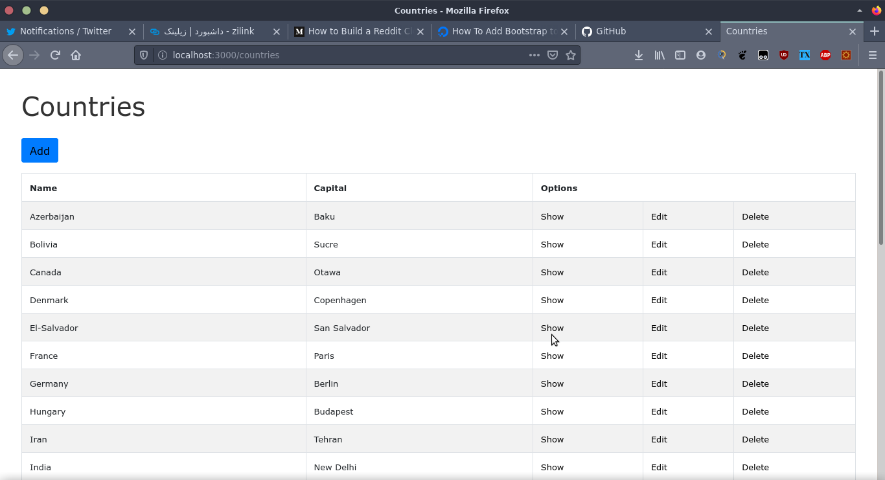

# Practice of Ruby on Rails and Bootstrap

[Bootstrap](http://getbootstap.com) is a CSS framework which can help you make more beautiful applications on the web. In this project, I just tried to add it to [Ruby on Rails](http://rubyonrails.org) to have something different than my previous projects. I created a simple `Countries` model with country names and their capital cities. It looks like this after I've done my modifications : 

## Helpful links

* [How to add bootstrap to rails projects](https://www.digitalocean.com/community/tutorials/how-to-add-bootstrap-to-a-ruby-on-rails-application)
* [Making a Reddit clone using rails](https://medium.com/@deallen7/how-to-build-a-reddit-like-site-with-ruby-on-rails-7b6cd106463d)

## How to run

as it has the database file, just install dependencies using `bundle` and then run it :-)